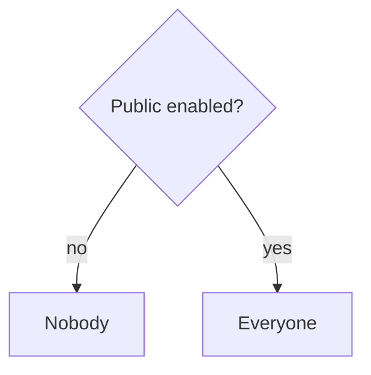
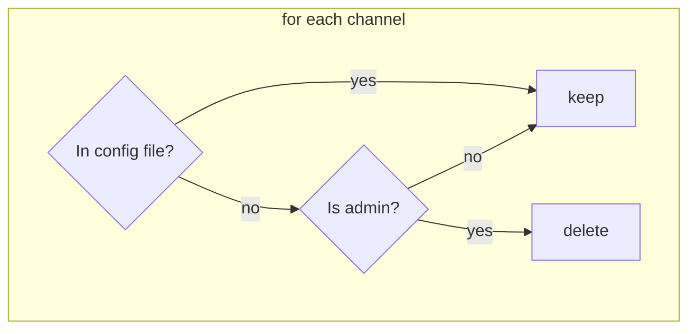

# Invites

This is just a braindump and helping hand for the implementation of a "public" mode that allows users to invite the bot on themselves.

## Who is eligible to invite the bot

## Permissions

* Admin
  * Use all bot features
  * Use full api features (single api key?)
* User
  * Use all bot features for single channel
  * Use api only for calendar files

## Channel types

* Admin: configured in the config file
* User: invited the bot 

## Channel sync

To keep the channel list up to date there needs to be some "cleaning" process.

