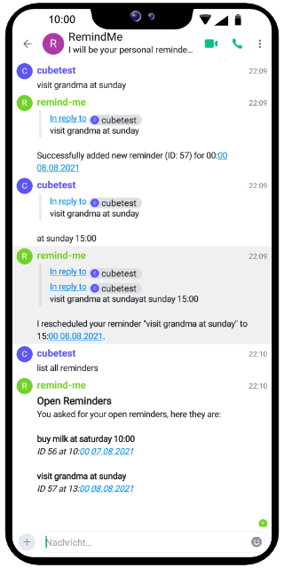
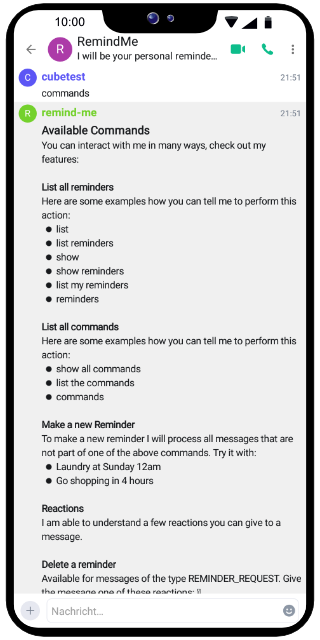

# Matrix reminder and calendar bot - RemindMe

[](https://github.com/CubicrootXYZ/matrix-reminder-and-calendar-bot/blob/main/LICENSE)
[](https://github.com/CubicrootXYZ/matrix-reminder-and-calendar-bot/issues)
[](https://github.com/CubicrootXYZ/matrix-reminder-and-calendar-bot/workflows/actions)


A matrix bot that handles reminders and knows your agenda.




## Features

* Schedule reminders
* Edit and delete reminders
* Timezone support
* Natural language understanding
* Quick actions via reactions

## Contribute

I really enjoy help in making this bot even better. So we all can enjoy the work on this project please follow the rules. 

### Issues, ideas and more

Please submit your issues or specific feature requests as "Issues". 

General ideas and concepts can be discussed in the "Discussions" section.

### Contributing code

Fork this repository and add your changes. Open a pull request to merge them in the master branch of this repository.

## How to use it

After you have installed the bot he will invite you in a channel accept the invite and you are ready to interact with him. 

Provided features:

* Add reminders in natural language
* Delete reminders

### New Reminder

To make a new reminder talk to the bot like this: 
```
Make laundry at Sunday 16:00
```

It tries to understand your natural language as best as it can. 

### List all available commands 

To get all commands just type one of these lines:
```
commands
list all commands
show all commands
```

## Installation

### Plain

1. Download the code
2. Run `go build -o /app/bin /app/cmd/remindme/main.go` to build the binary in `/app/bin`
3. Run the binary

### Docker

Different versions are available on docker hub:

[Docker Hub](https://hub.docker.com/repository/docker/cubicrootxyz/remindme)

## Attribution

Great thanks to the libraries used in this project:

* [Mautrix](https://github.com/tulir/mautrix-go)
* [Gorm](https://gorm.io/)
* [Gorm MySQL](https://github.com/go-gorm/mysql)
* [Naturaldate](https://github.com/tj/go-naturaldate)
* [Configor](https://github.com/jinzhu/configor)
* [Uniuri](https://github.com/dchest/uniuri)
