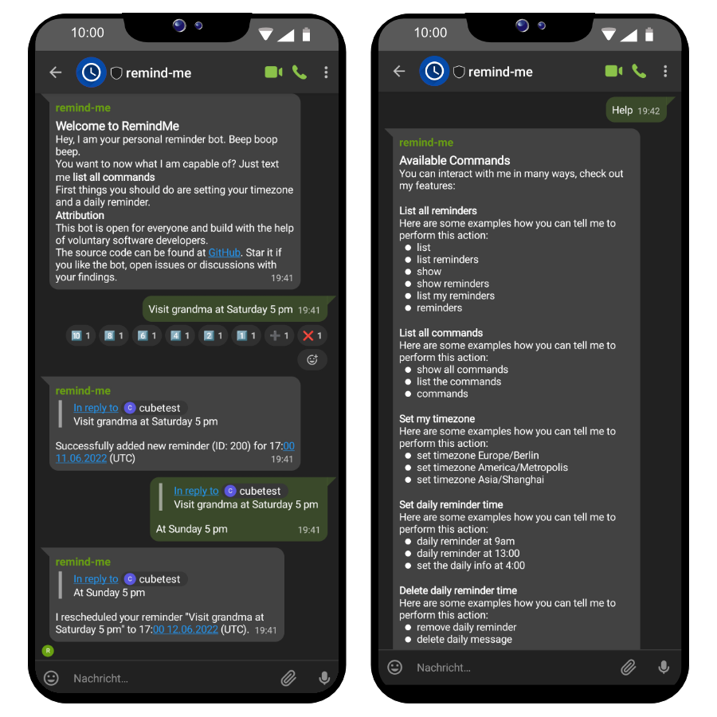

# Matrix reminder and calendar bot - RemindMe

A matrix bot that handles reminders and knows your agenda.

⚠️ The main branch currently contains the `v2` which is not backwards compatible. `v1` is moved to the similiar named branch. ⚠️

## Example

## 📋 Features

* Schedule reminders
* Edit and delete reminders
* Timezone support
* Natural language understanding
* Quick actions via reactions
* Daily message with open reminders for the day
* Repeatable reminders
* Import reminders from an Ical link _(via API)_
* iCal export of all reminders
* Allow bot to be invited _(enable in settings)_
* Whitelist of matrix accounts to interact with _(enable in settings)_
* HTTP API _(enable in settings)_

Not yet ported to `v2`:

* Block users _(via API)_

The following features are seen as **experimental**, we do not recommend them for use in production. Data losses or data leaks might happen.

* Multi-User channels

## 👩‍🔧 Contribute

See our [contribution guidelines](https://github.com/CubicrootXYZ/RemindMe/blob/main/CONTRIBUTING.md).

## 🔍 How to use the bot

After you have installed the bot it will invite every user in the config in a channel. Accept the invite and you are ready to interact with it.

### New Reminder

To make a new reminder talk to the bot like this: 
* `make laundry at sunday 16:00`
* `walking with the dog 6am`
* `brunch with alan at sunday`

It tries to understand your natural language as best as it can. 

### List all available commands 

To get all commands just type one of these lines:
* `commands`
* `list all commands`
* `show all commands`
* `help`

## ⚙️ Installation

See our [installation guides](https://github.com/CubicrootXYZ/RemindMe/wiki/Installation). We provide docker container images or you can build the binary yourself. 

## 📚 Further documentation 

Take a look into our [wiki](https://github.com/CubicrootXYZ/matrix-reminder-and-calendar-bot/wiki). It provides you with further information and troubleshooting guides.

### API

The bot offers an API. It needs to be enabled in the settings where the api key for the "Admin-Authentication" needs to be set. 

Currently the documentation is not provided in a human readable way.
